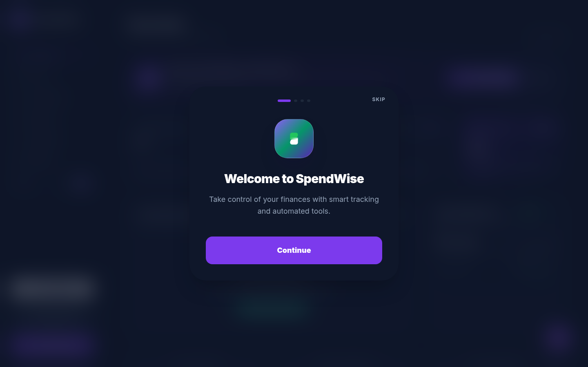
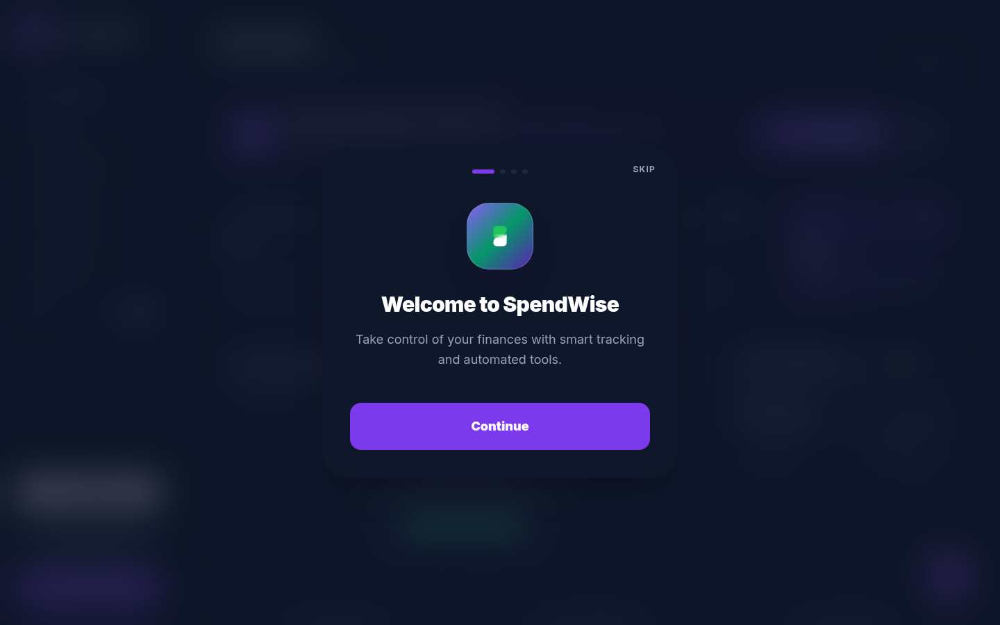
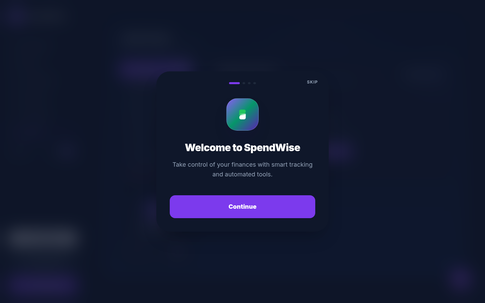

<div align="center">
  
  <h1>SpendWise AI</h1>
  <p><strong>A hyper-fast, offline-first personal finance platform with a built-in Natural Language Processing Engine.</strong></p>
</div>

---

## 🚀 The Ultimate Privacy-First Expense Tracker

SpendWise AI is a modern financial dashboard built for speed, privacy, and actionable intelligence. It completely eliminates the need for cloud servers by running all data processing, including advanced **Natural Language AI Queries**, directly inside your browser.



## ✨ Core Features

### 🧠 Offline NLP Chat Assistant
Say goodbye to expensive AI API keys and network latency. SpendWise features a custom-built, zero-latency **Natural Language Processing (NLP) Engine** that runs 100% locally. 
- Ask complex questions like *"How much budget is left?"* or *"Where did I spend the most money?"*
- Receive **interactive UI widgets** (progress bars, lists) rendered directly inside the chat bubbles!
- Your financial data never leaves your device.



### 💡 Smart Indian Merchant Categorization
SpendWise automatically categorizes your transactions as you type. It recognizes over 120+ Indian merchants (Swiggy, Zomato, Uber, Namma Yatri, IRCTC, ACT Fibernet) and UPI strings, instantly suggesting the correct category with a beautiful inline confirmation chip.

### 🏦 Multi-Account & Credit Intelligence
- **Vault Center**: Manage multiple bank accounts, cash wallets, credit cards, and UPI credit lines.
- **Credit Intelligence**: Real-time tracking of credit limits, outstanding liabilities, and smart repayment workflows directly from the Dashboard.
- **Dynamic Budget Rules**: Set static monthly caps or configure the engine to dynamically adjust your spending limits based on the 50/30/20 rule or your total monthly income.



### 📱 Progressive Web App (PWA)
Install SpendWise directly to your iOS or Android home screen. It features a standalone app experience, offline caching, and native-feeling gesture support.

## 🛠 Tech Stack

- **Frontend Core**: React 18 + TypeScript + Vite
- **Styling**: Tailwind CSS (with complex custom gradients and glassmorphism)
- **Icons**: Lucide React
- **Data Persistence**: LocalStorage + IndexedDB (Offline-First)

## 📦 Production Deployment

SpendWise is configured as a fully static Progressive Web App, making it incredibly cheap and easy to host anywhere.

### 1. Build for Production
```bash
npm run build
```
*This command compiles the React application and generates optimized static files in the `dist/` directory.*

### 2. Deploy to Vercel (Recommended)
SpendWise includes a `vercel.json` configuration file out of the box for perfect client-side routing.
```bash
npm i -g vercel
vercel deploy --prod
```

### 3. Deploy to Netlify
Simply drag and drop the `dist/` folder into Netlify, or link your GitHub repository. Netlify will automatically detect Vite and configure the build settings.

### 4. Docker / Nginx
If self-hosting, serve the `dist` directory using Nginx and ensure all requests are routed to `index.html`:
```nginx
location / {
  try_files $uri $uri/ /index.html;
}
```

## 🔒 Security & Privacy

We believe your financial data belongs to you.
- **Zero Telemetry**: SpendWise contains zero tracking scripts or analytics.
- **Local Storage**: All ledgers, accounts, and budgets are saved exclusively in your browser's local sandbox.
- **Secure Exports**: Generate full JSON backups or CSV ledgers at any time from the Vault Center.
